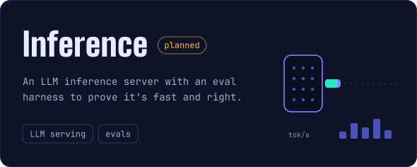

  

  

  

### What I'm building

  
  
  
  

### Competitive programming

  

### Toolbox

  

### Activity

  
  

  <picture>
    <source media="(prefers-color-scheme: dark)" srcset="profile/snake-dark.svg" />
    <source media="(prefers-color-scheme: light)" srcset="profile/snake-light.svg" />
    
  </picture>

